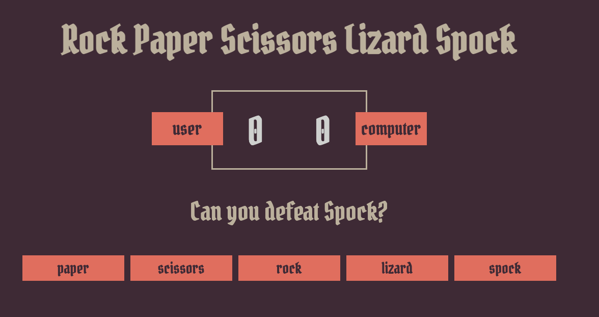
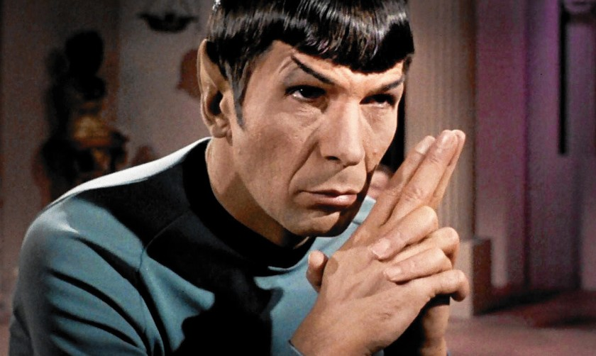

# Rock-paper-scissors-lizard-Spock

## My first game 
#### Why this game?

I started  a junior web development training at Becode.
We learned how to work with HTML, CSS and JavaScript. 
So this game is a combination from what i have learned the first month.

Everyone knows the game "rock, paper, scissors". 
Well, who watched the show "The Big Bang Theory". There is a scene with Sheldon where he explains the game
and added Lizard and Spock to it. 

###Before we play some rules:
"Scissors cut Paper", "Paper covers Rock", "Rock crushes Lizard",
"Lizard poisons Spock", "Spock smashes Scissors", "Scissors decapitate Lizard",
"Lizard eats Paper", "Paper disproves Spock", "Spock vaporizes Rock", "Rock crushes Scissors"

###This is how the game looks.

It's very easy. Just click one of the five buttons below "Can you defeat spock?"
The same text will change and say if you win, lose or if it's a tie.
Easy right?!
Also, those two zeros you see between user and computer. That's your score! 

### Enjoy it!

